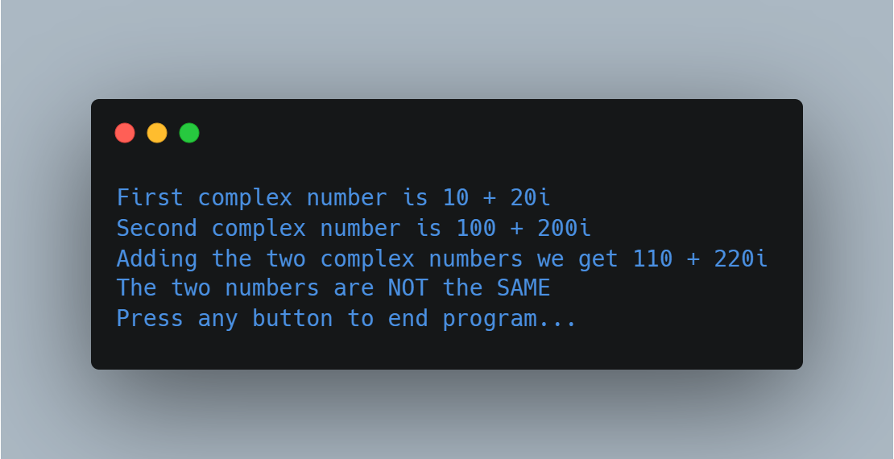

# Overloading Operators

(FSC-BCS-426-Lab6)

## Output

## Assignment Context

This project was one of the later assignments for my C# Programming class.

The goal of this assignment was for students to further explore C#, so we were prompted overload operators to do math with complex numbers.

This was a solo assignment made with C#, ASP.NET, and Visual Studio 2022.

## Features

Complex numbersand are commonly used in mathematics and engineering.
This code demonstrates operator overloading to make it possible to do math with complex numbers or numbers that with both a real and imaginary part.

## How It Works

The program defines a `ComplexNumber` class that represents a complex number. 
The class has two private fields: `RealPart` and `ImaginaryPart`, which represent the real and imaginary parts of the number. 
The class also defines a Constructor that takes a real and imaginary number, a `ToString` override, and a `GetHashCode` override. 
In addition, the class also overloads several operators, including `+`, `==`, and `!=`, defining what it means them with the `ComplexNumber` class. 
For example, overloading the `+` operator allows us to add two complex numbers by calling them together in a string.

The main program demonstrates the use of these overloaded operators by creating several instances of the `ComplexNumber` class and performing arithmetic operations with them using the overloaded operators.
It adds (10 + 20i) + (100 + 200i) together to get 110 + 220i by breaking down the real and imaginary numbers and adding them separately. 
It then uses the `==` operator to compare the two complex numbers in the same way. 
